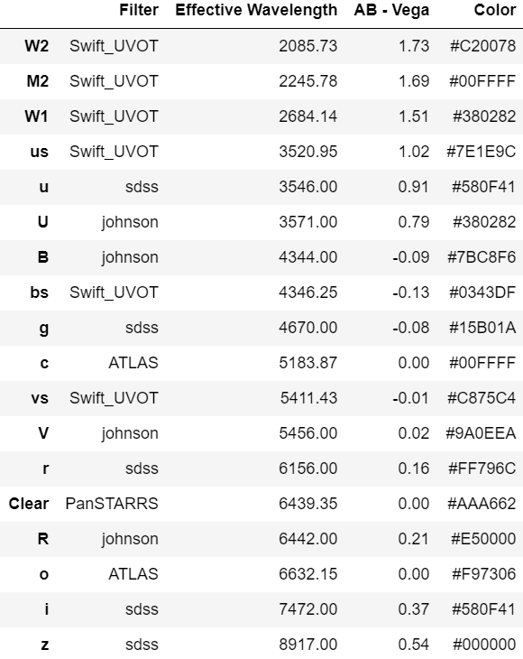

The table below contains the available filters that this package fits.
Your csv file should contain the appropriate filter label in order to use
a specified bandpass. For example, if you want to use the SWIFT_UVOT bandpass
for the blue filter for a certain magnitude, it's filter must be specified
as 'bs'.

The final output for the fitted parameters for each of the models
should have the following units:

1. ve = km/s 
2. mass = solar mass
3. radius = solar radii
4. offset = days

